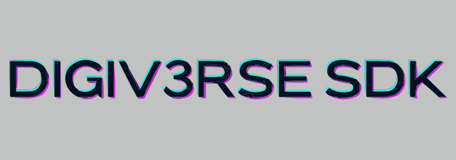

The official SDK for the [DiGiV3rse Protocol](https://www.digiv3rse.xyz/) 🌍.

- [Documentation](#documentation)
- [Contributing](#contributing)
  - [Setup](#setup)
  - [Running tests](#running-tests)
  - [Deduplicating dependencies](#deduplicating-dependencies)
- [Releasing new version](#releasing-new-version)
- [License](#license)
- [Support](#support)

## Documentation

All DiGi Protocol documentation, including this SDK documentation can be found at: https://docs.digiv3rse.xyz/docs

- [Introduction](https://docs.digiv3rse.xyz/docs/sdk-react-intro)
- [Getting Started](https://docs.digiv3rse.xyz/docs/sdk-react-getting-started)
- [Playground](https://github.com/digiv3rse/examples/)

## Contributing

Pull requests are welcome. For major changes, please open an issue first to discuss what you would like to change (issues template will be provided)

### Setup

Install monorepo dependencies by running this command in the root of the project:

```bash
pnpm install
```

Still in the root of the project, run the following command to build the packages:

```bash
pnpm build
```

### Running tests

To run the tests for all packages, run the following command in the repo root:

```bash
pnpm test
```

## Releasing new version

Release flow is managed by [changesets](https://github.com/changesets/changesets).

All publishable monorepo packages follow [`fixed`](https://github.com/changesets/changesets/blob/main/docs/fixed-packages.md) versioning scheme to keep things simple.

To release a new version follow the steps below:

1. Document new public facing changes during development.

```bash
pnpm changeset add
```

The command will ask a series of questions related to the introduced changes and the version bump that's required to follow semver range.

2. Once ready to do a release make sure that all libs are properly built (`dist` folders have the most up-to-date code) and the tests/lints are passing.

```bash
## run all from monorepo root
pnpm build

pnpm test

pnpm lint
```

3. Update relevant `package.json`'s versions and update `CHANGELOG.md` for each package.

```bash
pnpm changeset version
```

4. Review and commit new release. Create a PR to `main`.

5. Once all the steps above are done we are ready to publish a new release to the registry

_Note: Before publishing make sure that you are logged in to the correct npm account (run `pnpm whoami`). If not, follow prompts from `pnpm login`._

```bash
pnpm changeset publish
```

_Note: Because this command assumes that the last commit is the release commit, you should not commit any changes between calling version and publish._

6. Don't forget to push git tags after publishing to registry.

```bash
git push --follow-tags
```

7. It's important that the last commit, from which the release was made and the git tags are associated with, is correctly merged to the `main` branch. Use `"Create a merge commit"` option when merging the release branch to the `main`.

8. Finally, to avoid any differences between merge commit hashes, merge `main` to `develop` branch.

## License

DiGi SDK is [MIT licensed](./LICENSE)

                                 .''.
       .''.             *''*    :_\/_:     . 
      :_\/_:   .    .:.*_\/_*   : /\ :  .'.:.'.
  .''.: /\ : _\(/_  ':'* /\ *  : '..'.  -=:o:=-
 :_\/_:'.:::. /)\*''*  .|.* '.\'/.'_\(/_'.':'.'
 : /\ : :::::  '*_\/_* | |  -= o =- /)\    '  *
  '..'  ':::'   * /\ * |'|  .'/.\'.  '._____
      *        __*..* |  |     :      |.   |' .---"|
       _*   .-'   '-. |  |     .--'|  ||   | _|    |
    .-'|  _.|  |    ||   '-__  |   |  |    ||      |
    |' | |.    |    ||       | |   |  |    ||      |
 ___|  '-'     '    ""       '-'   '-.'    '`      |____
~~~~~~~~~~~~~~~~~~~~~~~~~~~~~~~~~~~~~~~~~~~~~~~~~~~~~~~~